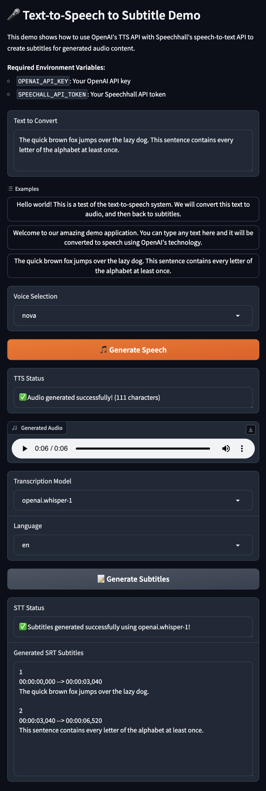

# Gradio Text-to-Speech to Subtitle Demo

This demo application demonstrates how to use OpenAI's Text-to-Speech API combined with Speechhall's Speech-to-Text API to generate subtitles for audio content.

## Features

- **Text Input**: Enter any text you want to convert to speech
- **Voice Selection**: Choose from 6 different OpenAI TTS voices
- **Audio Generation**: Convert text to high-quality speech audio
- **Audio Playback**: Play the generated audio directly in the browser
- **Subtitle Generation**: Transcribe the audio to SRT subtitle format
- **Model Selection**: Choose from different speech-to-text models
- **Language Support**: Support for multiple languages

### Screenshot



## Setup

### 1. Install Dependencies

```bash
# Using uv (recommended)
uv sync

# Or using pip
pip install -e .
```

### 2. Set Environment Variables

You need API keys for both services:

```bash
export OPENAI_API_KEY="your-openai-api-key"
export SPEECHALL_API_TOKEN="your-speechall-api-token"
```

Or create a `.env` file in the project root:

```
OPENAI_API_KEY=your-openai-api-key
SPEECHALL_API_TOKEN=your-speechall-api-token
```

### 3. Run the Demo

```bash
python gradio_demo.py
```

The application will start on `http://localhost:7860`

## How to Use

1. **Enter Text**: Type or paste the text you want to convert to speech
2. **Choose Voice**: Select from available OpenAI TTS voices (alloy, echo, fable, onyx, nova, shimmer)
3. **Generate Speech**: Click "🎵 Generate Speech" to create the audio
4. **Play Audio**: Use the audio player to listen to the generated speech
5. **Choose Model**: Select a speech-to-text model for transcription
6. **Generate Subtitles**: Click "📝 Generate Subtitles" to create SRT format subtitles
7. **View Results**: The SRT subtitle content will appear in the text area

## Use Cases

This demo is perfect for:

- **Content Creators**: Generate subtitles for voice-over content
- **Video Production**: Create synchronized subtitles for TTS narration
- **Accessibility**: Generate captions for synthetic speech
- **Quality Testing**: Compare original text with transcribed results
- **Workflow Testing**: Test the complete TTS → STT pipeline

# Main Script Examples

The `main.py` script provides comprehensive examples of using the Speechall API directly without the Gradio interface. It demonstrates various transcription scenarios and API features.

### Features Demonstrated

- **API Client Setup**: Authentication and configuration
- **Model Discovery**: List all available speech-to-text models
- **Local File Transcription**: Transcribe audio files from your local system
- **Remote URL Transcription**: Transcribe audio from web URLs
- **Advanced Features**: Speaker diarization, custom vocabulary, smart formatting
- **Multiple Output Formats**: JSON and plain text responses
- **Error Handling**: Comprehensive error handling and user feedback

### Running the Examples

1. **Set your API token**:
   ```bash
   export SPEECHALL_API_TOKEN="your-speechall-api-token"
   ```

2. **Update the audio file path** in the script (line 241):
   ```python
   local_audio_file = os.path.expanduser("~/Downloads/your-audio-file.mp3")
   ```

3. **Run the script**:
   ```bash
   python main.py
   ```

### Example Scenarios

The script includes five different transcription examples:

1. **List Available Models**: Discover all speech-to-text models and their capabilities
2. **Basic Local Transcription**: Transcribe a local audio file with custom language and model settings
3. **Remote URL Transcription**: Transcribe audio directly from a web URL with word-level timestamps
4. **Advanced Features**: Use speaker diarization, custom vocabulary, and smart formatting
5. **Default Options**: Simple transcription with minimal configuration

This script is perfect for:
- **Learning the API**: Understanding different features and options
- **Testing Integration**: Verify API connectivity and functionality
- **Batch Processing**: Process multiple audio files programmatically
- **Feature Exploration**: Try different models and advanced features

## API Information

- **OpenAI TTS**: Uses the `tts-1` model for fast, high-quality speech generation
- **Speechhall STT**: Supports multiple models including AssemblyAI, OpenAI Whisper, and Deepgram
- **Output Format**: Generates proper SRT subtitle format with timestamps

## Troubleshooting

- **Missing API Keys**: Make sure both environment variables are set correctly
- **Network Issues**: Check your internet connection and API quotas
- **Audio Issues**: Ensure your browser supports MP3 audio playback
- **Large Text**: Very long text may take time to process or hit API limits